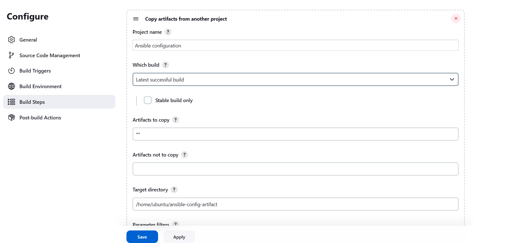
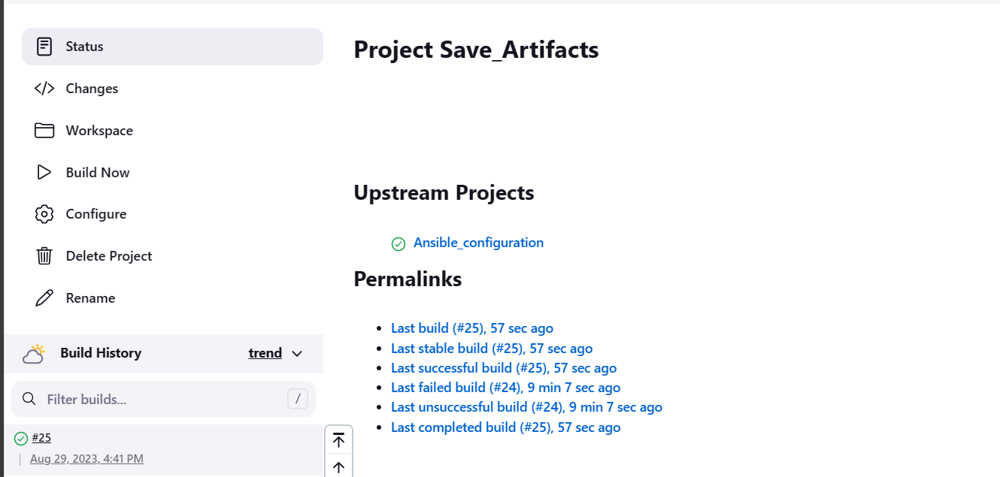

# ANSIBLE REFACTORING AND STATIC ASSIGNMENTS (IMPORTS AND ROLES)

## Step 1 - Jenkins Job enhancement

We need to make a change to our Jenkins server to save the builds at a more convenient location.

1. create a new directory in the home directory of our Jenkins-Ansible instance that will store all artifact after each build

        sudo mkdir /home/ubuntu/ansible-config-artifact
2. change the permissions to this directory and the ubuntu home Dir

        chmod -R 0777 /home/ubuntu/ansible-config-artifact
        sudo chmod 755 -R /home/ubuntu
3. From  the Jenkins web console, select Manage Jenkins and select Plugins and search for the **Copy Artifact** plugin. Install the plugin without restarting Jenkins.
4. Create a new Freestyle project and name if save_artifacts.

     
5. The save_artifact(downstream) will be triggered by the completion of ansible_configuration.
6. configure the save-artifact as shown below
  
   - in the general section, select the "Discard old builds option"
    
   - in the build trigger section, tick the build after other projects are built options and provide the name of the project to watch.
     .
   - For the build step, use the configuration show below
     
7. Save the configuration and edit the Readme file in the ansible-config-mgt repo in GitHub. observer the output in the Jenkins web console.
    
8. Open the Ansible-config-artifact Dir in your Jenkin-Ansible server and confirm the build has been saved as configured.
    

## Step 2: Refactor Ansible code

Before starting to refactor the codes, ensure that you have pulled down the latest code from master (main) branch, and created a new branch, name it refactor.
    

1. Create a new file called site.yml within the playbook folder of the ansible-config-mgt folder.
2. Create new root folder within the ansible-config-mgt.
3. Move the common.yml file into the static-assignments folder.

         mv playbooks/common.yml static-assigments
4. Update the common.yml file to remove the previously installed Wireshark application and rename the playbook to common-del.yml

       ---
        - name: Uninstall wireshark from webservers, nfsservers
          hosts: webservers, nfs_servers
          remote_user: ec2-user
          become: yes
          become_user: root
          tasks:
            - name: Uninstalling Wireshark from webservers and nfsservers
              package:
                name: wireshark
                state: removed

        - name: Uninstall wireshark from Load balancers and database servers
          hosts: lb, db
          remote_user: ubuntu
          become: yes
          become_user: root
          tasks:
            - name: Uninstalling Wireshark from Load balancers and database servers
              package:
                name: wireshark-qt
                state: absent
                autoremove: yes
                purge: yes
                autoclean: yes           

5. In the site.yml file, import the common.yml playbook.

        ---
        - hosts: all
        - import_playbook: ../static-assignments/common-del.yml

6. From the refractor branch, commit and push your code to the main branch.

        git status
        git add .
        git commit -m <commit message>
        git push orgin <your current branch name>

    

7. Pull the pushed repo and merge it to the main branch from the GitHub webpage.
    

8. The marge will automatically trigger a build in ansible.

    
9. To confirm if our artifact has been copy to the new directory, CD into the ansible-config-artifact and confirm same.
    
10. CD into the ansible-config-artifact directory and run a playbook against the dev.yml environment.

        cd ansible-config-artifacts
        cd ansible-playbook -i inventory/dev.yml playbooks/site.yaml
    
11. ssh into any of the client servers and confirm if Wireshack has been removed.
        

## CONFIGURE UAT WEBSERVERS WITH A ROLE ‘WEBSERVER’

1. Launch two RHEL instances using RedHat 8 image and name them Web1-UAT and web2-UAT.
    
2. We need to create a directory called roles, relative the playbook file or in /etc/ansible directory. This can be done in two ways.

      - use an ansible utility called ansible-galaxy inside the ansible-config-mgt/roles directory. Note this can only be done locally in the Jenkins server and hence might hinder the continuous integration.
      - Create the directory/file structure manually. (the method adopted for this project).
        
3. Update the inventory/uat.yml file with the the details of the 2 UAT webservers created in step 1.
        
4. In the webserver/task/main.yml and include the configuration that will do the following in the webservers

    - Install and configure Apache (httpd service)
    - Clone Tooling website from GitHub https://github.com/<your-name>/tooling.git.
    - Ensure the tooling website code is deployed to /var/www/html on each of 2 UAT Webservers.
    - Make sure httpd service is started.
5. Find configuration below. 

          ---
               - name: install apache
                 become: true
                 Package
                   name: "httpd"
                   state: present

               - name: install git
                 become: true
                 ansible.builtin.yum:
                   name: "git"
                   state: present

               - name: clone a repo
                 become: true
                 git:
                   repo: https://github.com/<your-name>/tooling.git
                   dest: /var/www/html
                   force: yes

               - name: copy html content to one level up
                 become: true
                 command: cp -r /var/www/html/html/ /var/www/

               - name: Start service httpd, if not started
                 become: true
                 service:
                   name: httpd
                   state: started

               - name: recursively remove /var/www/html/html/ directory
                 become: true
                 file:
                   path: /var/www/html/html
                   state: absent
6. From the static-assignments folder, create a new assignment for uat-webservers as shown below

        ---
        - hosts: uat-webservers
          roles:
              -webserver
7. From the playbooks/site.yml, comment out the existing plays and include the newly created playbook

        ---
         - hosts: all
         #- import_playbook: ../static-assignments/common.yml
         #- import_playbook: ../static-assignments/common-del.yml

         - hosts: uat-webservers
         - import_playbook: ../static-assignments/uat-webservers.yml.
  
## Commit and Test The Playbook

From the refractor branch, commit and push your code to the main branch.

              git status
              git add .
              git commit -m <commit message>
              git push orgin <your current branch name>

   

1. Pull the pushed repo and merge it to the main branch from the GitHub webpage.
    
     

2. The marge will automatically trigger a build in ansible.

    
3. To confirm if our artifact has been copy to the new directory, CD into the ansible-config-artifact and confirm same.
    
    
4. ssh into the Jenkin-Ansible server,cd into `ansubible-config-artifacts` directory and run the ansible playbook below.

        ansible-playbook -i inventory/uat.yml playbooks/site.yml

5. Confirm the availability of the tooling website with the command below

          http://<Web1-UAT-Server-Public-IP-or-Public-DNS-Name>/index.php
          or
          http://<Web1-UAT-Server-Public-IP-or-Public-DNS-Name>/index.php

      
 **END**